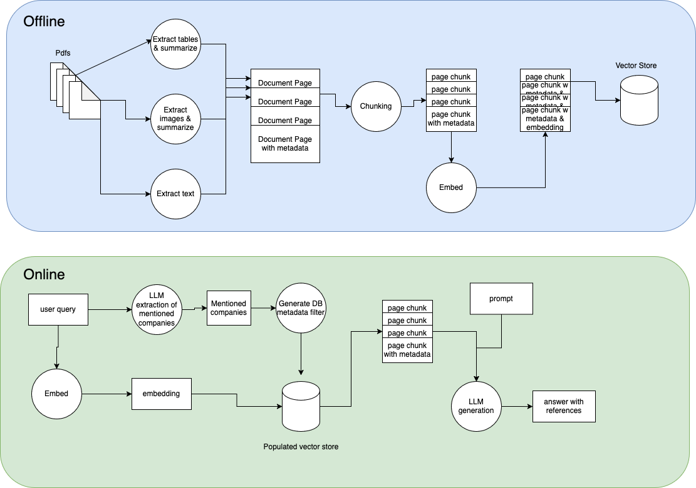

# FinanceQA

FinanceQA is an advanced Retrieval-Augmented Generation (RAG) system designed for financial document (i.e. 10Q fillings) question answering and analysis. It leverages state-of-the-art document processing, information extraction, and large language models to enable users to query and compare financial data from complex sources such as reports, tables, and images. The system supports end-to-end workflows including data extraction, summarization, database population, and interactive querying via a REST API.

For a high-level overview of the system architecture and data flow, please refer to the following diagram:



# Installation

## Pre-requisites

* [Docker installation](https://docs.docker.com/get-started/get-docker/)
* [Docker compose installation](https://docs.docker.com/compose/install/)

## Env

1. Copy .env.template to .env and add your own keys API keys. Also change the chroma DB path
2. Create the db

```bash
    docker compose up
```

3. Create a python env

    ```bash
    python3 -m venv env
    ```

4. Activate the env

```bash
    source env/bin/activate
```

5. Install the requirements

```bash
    pip install -r requirements.txt
```

6. Optionally test that the extensive 😊 test suite runs

```bash
    pytest tests
```

7. Populate the db (from root directory). The repo comes with some extracted information, such as summarized images and html extracted tables. Feel free to check the other scripts in the script folder to better understand how I obtained them (the naming of the scripts could use some improvement)

```bash
bash scripts/populate_db.sh
```

8. Run the app, from the root of the repo:

```bash
    uvicorn financeqa.app.main:app --host 0.0.0.0 --port 8010
```

9. Test the app

```bash
curl --location 'localhost:8010/query/' \
--header 'Content-Type: application/json' \
--header 'Authorization: secret-key' \
--data '[{
    "message": "compare the revenue of apple with that of microsoft in q3 2022"
}]'
```
